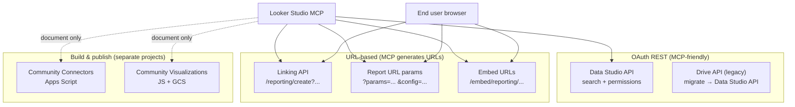

# Looker Studio MCP — Complete Integration Reference

> **Purpose:** This document catalogs every programmatic integration surface for Google Looker Studio (formerly Data Studio), what each one can and cannot do, and how to expose them as MCP tools. Use it as the blueprint for a dedicated `looker-studio-mcp` server or as a module in `google_workspace_mcp`.

---

## Table of contents

1. [Executive summary](#executive-summary)
2. [Integration landscape](#integration-landscape)
3. [What you cannot do (read this first)](#what-you-cannot-do-read-this-first)
4. [Data Studio REST API](#1-data-studio-rest-api)
5. [Linking API](#2-linking-api)
6. [Embed & share surfaces](#3-embed--share-surfaces)
7. [Report URL parameters](#4-report-url-parameters)
8. [Community Connectors](#5-community-connectors)
9. [Community Visualizations](#6-community-visualizations)
10. [Drive API migration context](#7-drive-api-migration-context)
11. [Proposed MCP tool catalog](#proposed-mcp-tool-catalog)
12. [Authentication matrix](#authentication-matrix)
13. [Architecture recommendations](#architecture-recommendations)
14. [Use-case playbook](#use-case-playbook)
15. [Setup guide](#setup-guide)
16. [Troubleshooting](#troubleshooting)
17. [Official references](#official-references)

---

## Executive summary

Looker Studio exposes **seven distinct integration surfaces**. They are **not** one unified API — each has different auth, transport, and capabilities.

| Surface | Type | Auth | Headless? | Primary use |
|---------|------|------|-----------|-------------|
| **Data Studio REST API** | OAuth REST | Workspace + admin DWD | ✅ Yes | Asset search, permissions, org migration |
| **Linking API** | URL builder | None (browser) | ❌ User click | Clone template reports with new data sources |
| **Embed (iframe/oEmbed)** | HTML/URL | Report sharing settings | Partial | Embed dashboards in apps/sites |
| **Report URL params** | URL builder | Report sharing settings | Partial | Dynamic filters via `params` / `config` |
| **Community Connectors** | Apps Script | Connector-specific | ✅ Yes (data fetch) | Custom data sources |
| **Community Visualizations** | JS on GCS | GCS public manifest | ❌ UI-only add | Custom chart types |
| **Drive API** (legacy) | OAuth REST | Standard OAuth | ✅ Yes | ⚠️ Deprecated path for LS assets — migrate to Data Studio API |

**Bottom line for dashboard building:** There is **no REST API** to create reports from scratch, add charts, edit layouts, or configure data blends/joins. The closest automation path is **template + Linking API + URL parameters**.

---

## Integration landscape



---

## What you cannot do (read this first)

These operations are **UI-only** in Looker Studio. No Google API exposes them:

| Operation | Available via API? | Workaround |
|-----------|-------------------|------------|
| Create blank report with custom layout | ❌ | Linking API → blank/default template; user saves manually |
| Add/edit/delete charts, pages, text | ❌ | Pre-build in template; clone via Linking API |
| Create data blends / SQL-style joins | ❌ | Pre-build blend in template; or join in BigQuery/dbt |
| Add table chart components | ❌ | Pre-build in template |
| Read report structure (charts, filters, dimensions) | ❌ | Data Studio API returns metadata only |
| Edit calculated fields in existing report | ❌ | Template inheritance via Linking API |
| Delete/trash reports via REST | ❌ | Not in Data Studio API (search shows `trashed` flag only) |
| Export report as PDF/image via API | ❌ | Manual UI or third-party browser automation |
| Set report-level theme/branding via API | ❌ | Template inheritance |

Google explicitly states:

> *"Deeper metadata like filters, sections, and dimensions within a report cannot be retrieved using the API."*
> — [Data Studio API](https://developers.google.com/looker-studio/integrate/api)

---

## 1. Data Studio REST API

**Docs:** [Overview](https://developers.google.com/looker-studio/integrate/api) · [Reference](https://developers.google.com/looker-studio/integrate/api/reference) · [Drive migration](https://developers.google.com/looker-studio/integrate/api/drive-migration)

### What it is

The only **true REST API** for Looker Studio. Designed for **Google Workspace / Cloud Identity organizations** to automate asset discovery, sharing, and migration.

**Base URL:** `https://datastudio.googleapis.com/v1`

### Requirements

1. Enable **Looker Studio API** (Data Studio API) in Google Cloud Console
2. Create OAuth 2.0 client (Web application)
3. **Workspace admin** must authorize the app via [domain-wide delegation](https://admin.google.com/ac/owl) with scopes:
   - `https://www.googleapis.com/auth/datastudio` (read/write)
   - or `https://www.googleapis.com/auth/datastudio.readonly` (read-only)
   - `https://www.googleapis.com/auth/userinfo.email`
   - `https://www.googleapis.com/auth/userinfo.profile`
4. **Do not** add Data Studio scopes to the OAuth consent screen — admin adds them in Admin Console
5. Users must belong to a **Workspace or Cloud Identity** org (personal Gmail won't work)

### OAuth scopes

| Scope | Access |
|-------|--------|
| `https://www.googleapis.com/auth/datastudio.readonly` | Search assets, read permissions |
| `https://www.googleapis.com/auth/datastudio` | Above + modify permissions |
| `https://www.googleapis.com/auth/userinfo.email` | User identity (always needed) |
| `https://www.googleapis.com/auth/userinfo.profile` | User profile |

### Endpoints

#### Assets — search

```
GET /v1/assets:search
```

| Parameter | Type | Description |
|-----------|------|-------------|
| `assetTypes` | **required** | `REPORT` or `DATA_SOURCE` (one per request) |
| `title` | optional | Search string; supports advanced syntax (see below) |
| `owner` | optional | Owner email |
| `includeTrashed` | optional | `true` = only trashed; `false` = exclude trashed (default) |
| `orderBy` | optional | `title`, `last_viewed_by_me`, `create_time`, `last_accessed_time`, `id` |
| `pageSize` | optional | Default 1000 |
| `pageToken` | optional | Pagination |

**Advanced `title` search syntax:**

| Filter | Example |
|--------|---------|
| Owned by me | `title=owner:me` |
| Created by me | `title=creator:me` |
| Title contains | `title=Sales` |
| Combined | `title=owner:me Sales` |

**Response — Asset object:**

| Field | Description |
|-------|-------------|
| `name` | Asset ID |
| `title` | Report/data source name |
| `description` | Description (reports only) |
| `owner` | Owner email |
| `creator` | Creator email |
| `createTime` | ISO timestamp |
| `updateTime` | ISO timestamp |
| `assetType` | `REPORT` or `DATA_SOURCE` |
| `trashed` | Boolean |

**View URL:** `https://lookerstudio.google.com/reporting/{name}`

#### Permissions — get

```
GET /v1/assets/{assetName}/permissions
```

Returns a single `Permissions` object (unlike Drive, which has many permission entries):

```json
{
  "permissions": {
    "OWNER": { "members": ["user:owner@example.com"] },
    "EDITOR": { "members": ["user:editor@example.com", "group:team@example.com"] },
    "VIEWER": { "members": ["user:viewer@example.com"] },
    "LINK_VIEWER": { "members": ["allUsers"] }
  },
  "etag": "BwXe3ECCjl0="
}
```

**Roles:** `OWNER`, `EDITOR`, `VIEWER`, `LINK_VIEWER`, `LINK_EDITOR`

**Member format:** `user:email@domain.com`, `group:group@domain.com`, `allUsers`

#### Permissions — add members

```
POST /v1/assets/{assetName}/permissions:addMembers
```

```json
{
  "role": "VIEWER",
  "members": ["user:alice@example.com", "user:bob@example.com"]
}
```

Cannot add to `OWNER` role.

#### Permissions — revoke members

```
POST /v1/assets/{assetName}/permissions:revokeAllPermissions
```

```json
{
  "members": ["user:alice@example.com"]
}
```

#### Permissions — patch (full update)

```
PATCH /v1/assets/{assetName}/permissions
```

Requires `etag` for optimistic concurrency. Call `get` first, modify, then patch.

**Limitation vs Drive API:** Cannot set `expirationTime` on permissions.

### Python client

```python
from googleapiclient.discovery import build

service = build("datastudio", "v1", credentials=credentials, static_discovery=False)
# May need raw httpx fallback if discovery doc unavailable:
# GET https://datastudio.googleapis.com/v1/assets:search?assetTypes=REPORT
# Authorization: Bearer {access_token}
```

### MCP tool mapping (REST API)

| Tool | Endpoint | Scope |
|------|----------|-------|
| `search_looker_studio_assets` | `assets:search` | readonly |
| `search_my_reports` | `assets:search?assetTypes=REPORT&title=owner:me` | readonly |
| `search_my_data_sources` | `assets:search?assetTypes=DATA_SOURCE&title=owner:me` | readonly |
| `get_asset_permissions` | `permissions.get` | readonly |
| `add_asset_members` | `permissions:addMembers` | datastudio |
| `revoke_asset_members` | `permissions:revokeAllPermissions` | datastudio |
| `update_asset_permissions` | `permissions.patch` | datastudio |
| `get_report_view_url` | helper | readonly |

---

## 2. Linking API

**Docs:** [Linking API](https://developers.google.com/looker-studio/integrate/linking-api)

### What it is

A **URL schema** — not a REST API. You construct URLs that open Looker Studio in the browser with pre-configured template reports and data sources. The user must **click the link** and **save** the report ("Edit and share").

**No OAuth required** to generate URLs. Access control depends on template permissions and underlying data access.

### Base URLs

| Purpose | URL |
|---------|-----|
| Create report | `https://lookerstudio.google.com/reporting/create?{params}` |
| Embed create | `https://lookerstudio.google.com/embed/reporting/create?{params}` |
| Legacy domain | `https://datastudio.google.com/...` (still works) |

### User workflow

1. Developer builds template report in Looker Studio UI
2. Developer constructs Linking API URL with template ID + data source overrides
3. User clicks URL → sees pre-configured report
4. User clicks **"Edit and share"** → report saved to their account
5. User has full control over their copy

### Control parameters (`c.*`)

| Parameter | Description | Default |
|-----------|-------------|---------|
| `c.reportId` | Template report ID (from URL between `reporting/` and `/page`) | Blank/default report |
| `c.pageId` | Initial page to load | First page |
| `c.mode` | `view` or `edit` | `view` |
| `c.explain` | Show debug dialog (`true`/`false`) | `false` |

### Report parameters (`r.*`)

| Parameter | Description |
|-----------|-------------|
| `r.reportName` | Name for the new report |
| `r.measurementId` | Google Analytics 4 measurement ID(s), comma-separated |
| `r.keepMeasurementId` | `true` = inherit from template |

### Data source parameters (`ds.{alias}.*`)

Each data source in the template has an **alias** (e.g. `ds0`, `ds1`) visible in the report editor URL or data source settings.

| Parameter | Description |
|-----------|-------------|
| `ds.{alias}.connector` | Connector type (see table below). If set → **replace** entire config |
| `ds.{alias}.datasourceName` | Data source display name |
| `ds.{alias}.keepDatasourceName` | `true` = keep template name |
| `ds.{alias}.refreshFields` | Refresh fields from new config (`true`/`false`) |

**Replace vs update:**

| `ds.connector` set? | Behavior |
|---------------------|----------|
| **Yes** | Replace entire data source config; all required params must be provided |
| **No** | Update only specified params; template config fills the rest |

### Supported connectors (Linking API)

| Connector | `ds.connector` value | Key parameters |
|-----------|---------------------|----------------|
| **BigQuery (table)** | `bigQuery` | `type=TABLE`, `projectId`, `datasetId`, `tableId`, `billingProjectId`, `isPartitioned` |
| **BigQuery (SQL)** | `bigQuery` | `type=CUSTOM_QUERY`, `sql`, `sqlReplace`, `billingProjectId` |
| **Google Sheets** | `googleSheets` | `spreadsheetId`, `worksheetId`, `range`, `hasHeader` |
| **Google Analytics** | `googleAnalytics` | `accountId`, `propertyId`, `viewId` (UA only) |
| **Search Console** | `searchConsole` | `siteUrl`, `tableType`, `searchType` |
| **Cloud Spanner** | `cloudSpanner` | `projectId`, `instanceId`, `databaseId`, `sql` |
| **Google Cloud Storage** | `googleCloudStorage` | `pathType` (FILE/FOLDER), `path` |
| **Looker (BI product)** | `looker` | `instanceUrl`, `model`, `explore` |
| **Community Connector** | `community` | `connectorId`, custom params |

### Example URLs

**Clone template with BigQuery table:**

```
https://lookerstudio.google.com/reporting/create?
  c.reportId=TEMPLATE_ID
  &c.mode=edit
  &r.reportName=Client Dashboard
  &ds.ds0.connector=bigQuery
  &ds.ds0.type=TABLE
  &ds.ds0.projectId=my-project
  &ds.ds0.datasetId=analytics
  &ds.ds0.tableId=daily_metrics
```

**Clone template with Google Sheets:**

```
https://lookerstudio.google.com/reporting/create?
  c.reportId=TEMPLATE_ID
  &c.mode=edit
  &ds.ds0.connector=googleSheets
  &ds.ds0.spreadsheetId=SHEET_ID
  &ds.ds0.worksheetId=0
```

**Update only SQL in template (no connector replace):**

```
https://lookerstudio.google.com/reporting/create?
  c.reportId=TEMPLATE_ID
  &ds.ds0.sql=SELECT%20*%20FROM%20%60project.dataset.table%60
```

**Blank report:**

```
https://lookerstudio.google.com/reporting/create?r.reportName=New Report
```

### Template permissions (critical)

| Data source type | Linking config | User needs data source access? |
|------------------|----------------|-------------------------------|
| Embedded | Replace or Update | No (inherited from report) |
| Reusable | Replace | No |
| Reusable | Update | **Yes** (must read template DS config) |

### MCP tool mapping (Linking API)

These tools **generate URLs** — they do not call Google servers:

| Tool | Description |
|------|-------------|
| `build_linking_api_url` | Full URL builder with all params |
| `build_report_from_template` | Convenience: template + connector config |
| `build_sheets_report_url` | Template + Google Sheets source |
| `build_bigquery_report_url` | Template + BigQuery table or SQL |
| `build_embed_create_url` | Linking API with `/embed/` path |
| `extract_report_id_from_url` | Parse report ID from Looker Studio URL |
| `extract_datasource_alias_from_url` | Parse DS alias from editor URL |

---

## 3. Embed & share surfaces

**Docs:** [Embed and snippets](https://developers.google.com/looker-studio/integrate/embed)

### What it is

Mechanisms to **display** existing reports in external contexts. Not an API — configuration is done in the Looker Studio UI ("Embed report" menu).

### iframe embed

```html
<iframe
  width="600" height="920"
  src="https://lookerstudio.google.com/embed/reporting/{REPORT_ID}/page/{PAGE_ID}"
  frameborder="0"
  style="border:0"
  allowfullscreen>
</iframe>
```

**Requirements:**
- Report owner enables embedding in report settings
- Viewer has access (or report is "Anyone with link")

### oEmbed

Paste a report URL into platforms supporting oEmbed (Medium, Reddit, etc.). No API call — platform fetches oEmbed metadata automatically.

### Open Graph snippets

Sharing a report URL on Twitter, Facebook, LinkedIn, Slack renders rich previews via Open Graph tags. Automatic — no developer action.

### MCP tool mapping (Embed)

| Tool | Description |
|------|-------------|
| `build_embed_url` | `{base}/embed/reporting/{id}/page/{pageId}` |
| `build_iframe_html` | Full iframe snippet |
| `build_embed_url_with_params` | Embed + `params` or `config` query string |

---

## 4. Report URL parameters

**Docs:** [Overridable config parameters](https://developers.google.com/looker-studio/connector/data-source-parameters) · [Row-level security for embeds](https://developers.google.com/looker-studio/connector/embed-row-level-security)

### What it is

Dynamic parameter injection into **existing** report view/embed URLs. Enables per-user filtering without rebuilding the report.

### Standard report parameters (`params`)

For reports with parameters marked **"Allow to be modified in the report URL"** (Resource → Manage report parameters):

```
https://lookerstudio.google.com/reporting/{REPORT_ID}/page/{PAGE_ID}?params={URL_ENCODED_JSON}
```

**Example** — set a zipcode parameter:

```javascript
const params = JSON.stringify({ "ds0.zipcode": "94094" });
const url = `https://lookerstudio.google.com/reporting/REPORT_ID/page/PAGE_ID?params=${encodeURIComponent(params)}`;
```

### Community Connector config (`config`)

For embedded reports using Community Connectors with overridable config (row-level security):

```
https://lookerstudio.google.com/embed/reporting/{REPORT_ID}/page/{PAGE_ID}?config={URL_ENCODED_JSON}
```

**Example** — pass auth token for row-level filtering:

```javascript
const config = JSON.stringify({ "ds0": { "token": "USER_TOKEN" } });
const url = `https://lookerstudio.google.com/embed/reporting/REPORT_ID/page/PAGE_ID?config=${encodeURIComponent(config)}`;
```

The Community Connector reads `request.configParams.token` in `getData()` and filters accordingly.

### Parameter precedence (lowest → highest)

1. Data source default
2. Report URL (`params` / `config`)
3. Report properties panel (editor overrides)

### MCP tool mapping (URL params)

| Tool | Description |
|------|-------------|
| `build_report_url_with_params` | Append `params` JSON for standard parameters |
| `build_embed_url_with_config` | Append `config` JSON for connector RLS |
| `encode_report_params` | Helper: object → URL-encoded JSON string |

---

## 5. Community Connectors

**Docs:** [Overview](https://developers.google.com/looker-studio/connector) · [API Reference](https://developers.google.com/looker-studio/connector/reference) · [Report templates](https://developers.google.com/looker-studio/connector/report-templates) · [Embed RLS](https://developers.google.com/looker-studio/connector/embed-row-level-security)

### What it is

**Custom data sources** built with **Google Apps Script**. Lets Looker Studio pull data from any HTTP-accessible API, database (via JDBC), or computed source.

This is **not** part of the Data Studio REST API. Connectors are separate Apps Script deployments.

### Required functions

| Function | Purpose |
|----------|---------|
| `getAuthType()` | NONE, OAUTH2, USER_PASS, KEY |
| `getConfig()` | User-configurable options (text inputs, selects, checkboxes) |
| `getSchema()` | Field definitions (dimensions, metrics, types) |
| `getData()` | Fetch and return data rows |
| `get3PAuthorizationUrls()` | OAuth2 only — auth URL |
| `authCallback()` | OAuth2 only — handle callback |
| `isAdminUser()` | Optional — admin features |
| `resetAuth()` | Optional — clear stored auth |

### What connectors enable

| Capability | Via connector? |
|------------|-------------|
| Pull data from custom REST APIs | ✅ |
| Dynamic schema based on config | ✅ |
| Row-level security via embed tokens | ✅ |
| Ship default report templates | ✅ (manifest `templates.default`) |
| Create/edit report layout | ❌ |
| Replace built-in Google connectors | Partial (users choose your connector) |

### Connector manifest — report templates

```json
{
  "dataStudio": {
    "name": "My Connector",
    "templates": {
      "default": "0B1a5IAKYIVtTcWxCbWJkc2Q1M1k"
    }
  }
}
```

When users create a data source from your connector, Looker Studio can offer a pre-built report template.

### Distribution

- Share deployment link directly
- Submit to [Connector Gallery](https://lookerstudio.google.com/gallery) for public listing

### MCP relevance

Community Connectors are **not callable from an MCP server** directly (they run in Apps Script inside Google's infrastructure). The MCP can:

- Document connector setup
- Generate Linking API URLs pointing to `connector=community`
- Generate embed URLs with `config` tokens for RLS
- Manage permissions on reports that use the connector (via Data Studio REST API)

---

## 6. Community Visualizations

**Docs:** [Overview](https://developers.google.com/looker-studio/visualization) · [Get started](https://developers.google.com/looker-studio/visualization/get-started) · [Publish](https://developers.google.com/looker-studio/visualization/publish)

### What it is

**Custom JavaScript chart types** hosted on **Google Cloud Storage**. Users add them to reports via manifest path (`gs://bucket/path`).

Built with HTML/CSS/JS + the [dscc helper library](https://developers.google.com/looker-studio/visualization/library).

### Required files (on GCS)

| File | Purpose |
|------|---------|
| `manifest.json` | Component metadata, resource paths |
| `{name}.js` | Visualization logic |
| `{name}.json` | Style/config schema |
| `{name}.css` | Styling |

### What visualizations enable

| Capability | Via visualization? |
|------------|-------------------|
| Custom chart types (Sankey, funnel, heatmap) | ✅ |
| Custom styling/brand | ✅ |
| Receive data from any LS data source | ✅ |
| Programmatically add to report | ❌ (user adds via UI) |
| Modify report layout via API | ❌ |

### MCP relevance

Not directly MCP-exposed. Document for completeness. Users add visualizations manually in the report editor.

---

## 7. Drive API migration context

**Docs:** [Migrating from Drive API](https://developers.google.com/looker-studio/integrate/api/drive-migration)

Historically, Looker Studio assets were managed via the **Drive API** (`mimeType` filters). Google now recommends the **Data Studio API** instead.

| Drive API | Data Studio API equivalent |
|-----------|---------------------------|
| `files.list` (LS mimeTypes) | `assets:search` |
| `permissions.list` | `permissions.get` (single object, no pagination) |
| `permissions.create/update` | `permissions.addMembers` / `patch` |
| `permissions.delete` | `permissions.revokeAllPermissions` |
| `files.create` | ❌ No equivalent — use Linking API |
| `files.delete` | ❌ Not available |
| `permissions` with `expirationTime` | ❌ Not supported in Data Studio API |

If your org still uses Drive API for Looker Studio assets, migrate to Data Studio API for permissions and search.

---

## Proposed MCP tool catalog

Full tool set for a dedicated Looker Studio MCP, grouped by integration surface.

### Tier 1 — Core (Data Studio REST API + OAuth)

| Tool | Read/Write | Description |
|------|------------|-------------|
| `start_google_auth` | — | Trigger OAuth flow |
| `search_looker_studio_assets` | Read | Search reports or data sources |
| `search_my_reports` | Read | `owner:me` reports shortcut |
| `search_my_data_sources` | Read | `owner:me` data sources shortcut |
| `get_asset_details` | Read | Format single asset from search |
| `get_asset_permissions` | Read | Role → members map |
| `add_asset_members` | Write | Add VIEWER/EDITOR members |
| `revoke_asset_members` | Write | Remove members |
| `update_asset_permissions` | Write | Full permission patch with etag |
| `get_report_view_url` | Read | Build view link from asset ID |

### Tier 2 — URL builders (no OAuth needed)

| Tool | Description |
|------|-------------|
| `build_linking_api_url` | General Linking API URL constructor |
| `build_report_from_template` | Template + data source override |
| `build_sheets_report_url` | Template + Google Sheets |
| `build_bigquery_report_url` | Template + BigQuery table or SQL |
| `build_community_connector_report_url` | Template + community connector |
| `build_embed_url` | iframe embed URL |
| `build_iframe_html` | Complete iframe HTML snippet |
| `build_report_url_with_params` | View URL + `params` for filters |
| `build_embed_url_with_config` | Embed URL + `config` for RLS |
| `parse_looker_studio_url` | Extract report ID, page ID, DS alias |

### Tier 3 — Helpers & docs (optional)

| Tool | Description |
|------|-------------|
| `list_linking_api_connectors` | Return supported connector types + params |
| `explain_looker_studio_limitations` | Return capability matrix (for LLM context) |
| `get_admin_setup_instructions` | Domain-wide delegation setup steps |

---

## Authentication matrix

| Integration | OAuth needed? | Admin DWD? | Works with personal Gmail? |
|-------------|---------------|------------|---------------------------|
| Data Studio REST API | ✅ User OAuth | ✅ Required | ❌ Workspace only |
| Linking API URL gen | ❌ | ❌ | ✅ (URL gen); user needs data access |
| Embed URL gen | ❌ | ❌ | ✅ |
| Report URL params | ❌ | ❌ | ✅ |
| Community Connectors | Separate (Apps Script) | Depends on connector | ✅ |
| Community Visualizations | ❌ (GCS hosting) | ❌ | ✅ |

### Recommended MCP auth stack

Reuse `google_workspace_mcp` patterns:

- **OAuth 2.0 lazy flow** for stdio (Claude Desktop)
- **OAuth 2.1 multi-user** for HTTP (`MCP_ENABLE_OAUTH21=true`)
- **Single-user mode** for personal dev (`--single-user`)
- Credential store: `~/.looker_studio_mcp/credentials/{email}.json`

---

## Architecture recommendations

```
looker-studio-mcp/
├── auth/          # Copy from google_workspace_mcp (OAuth infra)
├── core/          # FastMCP server, tool registry, error handling
├── gdatastudio/
│   ├── datastudio_tools.py    # Tier 1 REST API tools
│   ├── linking_tools.py       # Tier 2 URL builders
│   └── helpers.py             # Formatting, URL parsing, constants
├── main.py
├── fastmcp_server.py
└── docs/
    └── looker-studio-mcp.md     # This file
```

**Design principles:**

1. REST API tools use `@require_google_service("datastudio", ...)` + `asyncio.to_thread()`
2. URL builder tools are **pure functions** — no OAuth, no network calls
3. Return **formatted strings** for LLM consumption, not raw JSON
4. Mark read tools `is_read_only=True` on `@handle_http_errors`
5. Document Workspace admin requirement prominently in every auth error

---

## Use-case playbook

| I want to… | Use this | MCP tool |
|------------|----------|----------|
| List all dashboards in my org | Data Studio REST API | `search_looker_studio_assets` |
| Find reports I own | Data Studio REST API | `search_my_reports` |
| Share a dashboard with a colleague | Data Studio REST API | `add_asset_members` |
| Audit who can see a report | Data Studio REST API | `get_asset_permissions` |
| Give each client a copy of a template dashboard | Linking API | `build_report_from_template` |
| Point template at client's BigQuery table | Linking API | `build_bigquery_report_url` |
| Point template at client's Google Sheet | Linking API | `build_sheets_report_url` |
| Embed dashboard in my SaaS app | Embed URL | `build_embed_url` / `build_iframe_html` |
| Filter embedded dashboard per logged-in user | Report URL `config` + Community Connector | `build_embed_url_with_config` |
| Pull data from my proprietary API into LS | Community Connector (Apps Script) | Document only; separate project |
| Custom Sankey/funnel chart | Community Visualization (GCS) | Document only; separate project |
| Migrate from Drive API asset listing | Data Studio REST API | `search_looker_studio_assets` |
| Create dashboard layout programmatically | ❌ Not possible | Pre-build template |
| Create data joins/blends programmatically | ❌ Not possible | Pre-build in template or join in SQL |

---

## Setup guide

### 1. Google Cloud Console

1. Create/select project
2. Enable **Looker Studio API** ([API Console link](https://console.cloud.google.com/apis/library/datastudio.googleapis.com))
3. Create OAuth 2.0 Client ID (Web application)
4. Configure OAuth consent screen (Internal for Workspace org)

### 2. Workspace Admin Console

1. Go to [Admin → Security → API Controls → Domain-wide delegation](https://admin.google.com/ac/owl)
2. Add new API client with your OAuth **Client ID**
3. Authorize scopes (comma-separated):
   ```
   https://www.googleapis.com/auth/datastudio,https://www.googleapis.com/auth/userinfo.email,https://www.googleapis.com/auth/userinfo.profile
   ```
4. Use `.readonly` scope if write tools are not needed

### 3. MCP server env vars

```bash
GOOGLE_OAUTH_CLIENT_ID="..."
GOOGLE_OAUTH_CLIENT_SECRET="..."
LOOKER_STUDIO_MCP_PORT="8000"
OAUTHLIB_INSECURE_TRANSPORT="1"   # localhost dev only
```

### 4. Claude Desktop config

```json
{
  "mcpServers": {
    "looker-studio": {
      "command": "uvx",
      "args": ["looker-studio-mcp"],
      "env": {
        "GOOGLE_OAUTH_CLIENT_ID": "YOUR_CLIENT_ID",
        "GOOGLE_OAUTH_CLIENT_SECRET": "YOUR_CLIENT_SECRET"
      }
    }
  }
}
```

### 5. Linking API setup (no OAuth)

1. Build a template report in Looker Studio UI (charts, blends, styling)
2. Note the **report ID** from the URL (`reporting/{ID}/page/...`)
3. Note each data source **alias** (`ds0`, `ds1`, …)
4. Grant viewers access to the template (view permission minimum)
5. Use MCP URL builder tools to generate client-specific links

---

## Troubleshooting

| Error / symptom | Cause | Fix |
|-----------------|-------|-----|
| `Error 400: invalid_scope` | Admin hasn't authorized app | Request admin add Client ID + scopes in DWD |
| No OAuth dialog shown | Admin pre-authorized org | Expected; verify token works with a tool call |
| `403 Forbidden` on API call | User not in Workspace org | Use Workspace account |
| Linking API → config error | User lacks template/data access | Check template permissions table |
| Linking API → blank charts | Underlying data inaccessible | User needs access to BQ table / Sheet |
| `refreshFields=false` + wrong fields | New data source has different schema | Set `refreshFields=true` or match template schema |
| Embed shows "Report not found" | Embedding not enabled | Enable in report settings |
| `params` ignored | Parameter not marked URL-modifiable | Resource → Manage report parameters → checkbox |
| Discovery build fails | No static discovery doc | Use `static_discovery=False` or raw httpx |

---

## Official references

| Topic | URL |
|-------|-----|
| Integrate hub | https://developers.google.com/looker-studio/integrate |
| Data Studio REST API | https://developers.google.com/looker-studio/integrate/api |
| API reference | https://developers.google.com/looker-studio/integrate/api/reference |
| assets:search | https://developers.google.com/looker-studio/integrate/api/reference/assets/search |
| Permissions API | https://developers.google.com/looker-studio/integrate/api/reference/permissions/get |
| Drive API migration | https://developers.google.com/looker-studio/integrate/api/drive-migration |
| Linking API | https://developers.google.com/looker-studio/integrate/linking-api |
| Embed & snippets | https://developers.google.com/looker-studio/integrate/embed |
| Report URL parameters | https://developers.google.com/looker-studio/connector/data-source-parameters |
| Embed row-level security | https://developers.google.com/looker-studio/connector/embed-row-level-security |
| Community Connectors | https://developers.google.com/looker-studio/connector |
| Connector API reference | https://developers.google.com/looker-studio/connector/reference |
| Community Visualizations | https://developers.google.com/looker-studio/visualization |
| Publish connector/visualization/report | https://developers.google.com/looker-studio/integrate |

---

*Last updated: 2026-06-03. Looker Studio APIs evolve slowly; verify against official docs before production deployment.*
